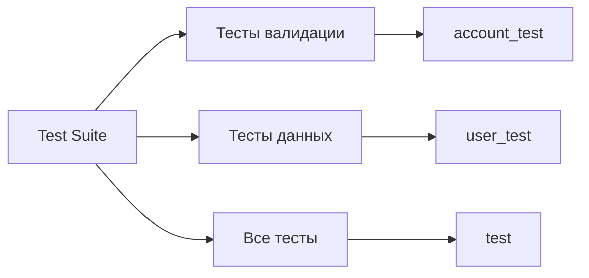
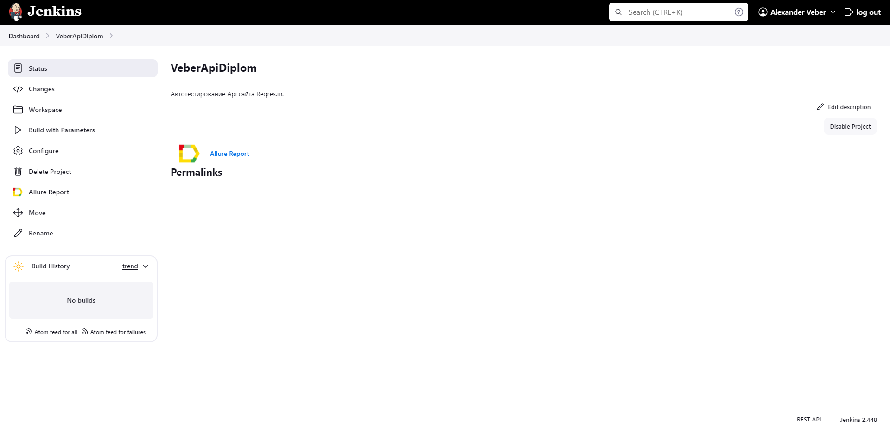
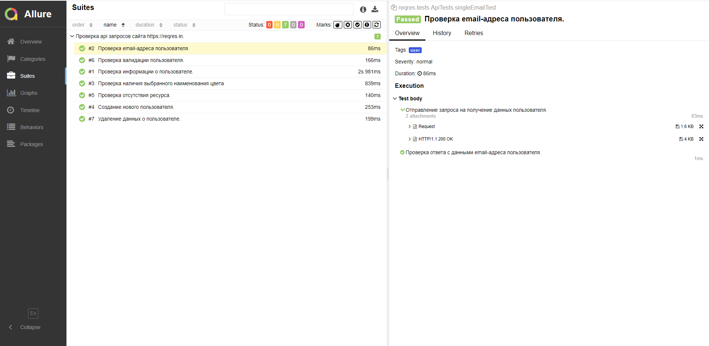
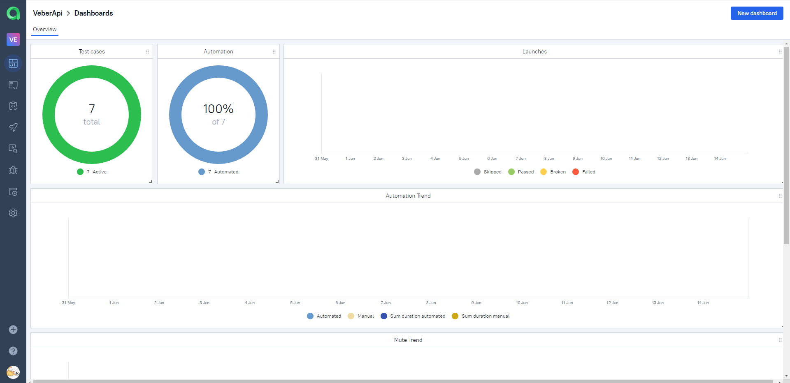
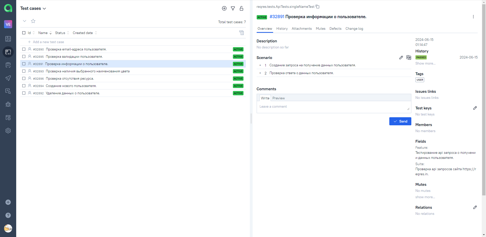
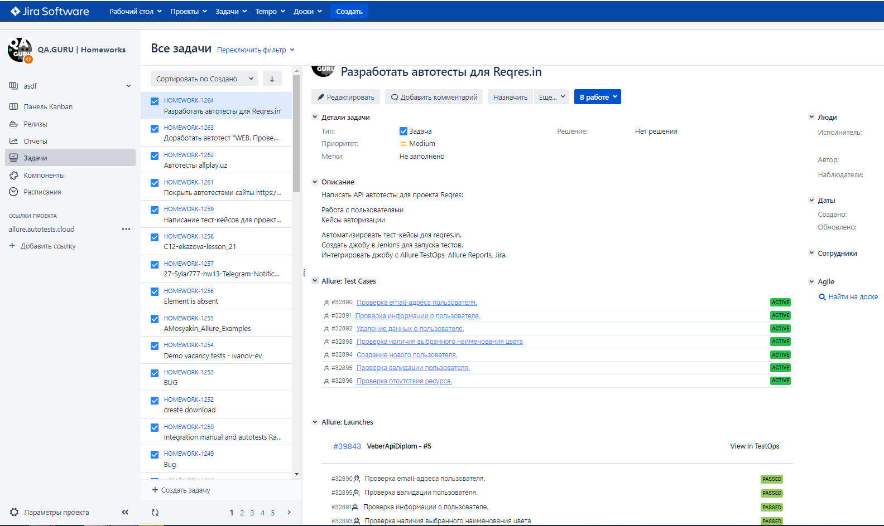
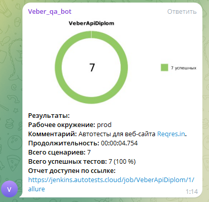

# Проект по автоматизации тестирования API сервиса Reqres

## Содержание:

- <a href="#tools"> Технологии и инструменты.</a>
- <a href="#checking"> Реализованные проверки.</a>
- <a href="#console"> Запуск тестов из терминала.</a>
- <a href="#jenkins"> Сборка в Jenkins.</a>
- <a href="#allureReport"> Allure - отчет.</a>
- <a href="#allure"> Интеграция с Allure TestOps.</a>
- <a href="#jira"> Задача в Jira с отображением тест-кейсов и запусками.</a>  
- <a href="#tg"> Уведомление о пройденных тестах в Telegram.</a>
---

## Технологии и инструменты:

Автотесты написаны на языке `Java` с использованием `JUnit 5`, `Selenide`, `Rest-Assured`. Сборщик проекта - `Gradle`. Для удаленного запуска реализована задача в `Jenkins` с формированием `Allure-отчета` и
отправкой результатов в `Telegram канал` при помощи бота. Так же осуществлена интеграция с `Allure TestOps` и `Jira`.

---

## Реализованные проверки:

- Проверка наличия email-адреса пользователя.
- Проверка валидации пользователя.
- Проверка информации о пользователе.
- Проверка наличия выбранного наименования цвета.
- Проверка отсутствия ресурса.
- Проверка успешного создания нового пользователя.
- Проверка успешного удаления данных о пользователе.

### Локальный запуск тестов из терминала
`gradle clean test`

---

### Варианты запуска тестов

Для запуска тестов можно выбрать следующие способы:

`gradle clean ...`

---

## Сборка в <a target="_blank" href="https://jenkins.autotests.cloud/job/VeberApiDiplom/"> Jenkins </a>
Для запуска сборки необходимо перейти в раздел <code>Собрать с параметрами</code>, выбрать необходимые параметры и нажать кнопку <code>Собрать</code>.

После выполнения сборки, в блоке История сборок напротив номера сборки появятся значки Allure Report и Allure TestOps, при клике на которые откроется страница с сформированным html-отчетом и тестовой документацией соответственно.

---

## [Allure](https://jenkins.autotests.cloud/job/VeberApiDiplom/allure/) отчет

### Главная страница отчета

### Тест-кейсы

---

## Интеграция с <a target="_blank" href="https://allure.autotests.cloud/project/4287/dashboards">Allure TestOps</a>
На *Dashboard* в <code>Allure TestOps</code> видна статистика количества тестов. Новые тесты, а так же результаты прогона приходят по интеграции при каждом запуске сборки.
## Основная страница отчёта

  
  

  

## Пример тест-кейса

---

## Задача в [Jira](https://jira.autotests.cloud/projects/HOMEWORK/issues/HOMEWORK-1264).

Реализована интеграция <code>Allure TestOps</code> с <code>Jira</code>, в тикете отображается, какие тест-кейсы были написаны в рамках задачи и результат их прогона.
### Задача в Jira

#### Содержание задачи

- Цель
- Задачи для выполнения
- Тест-кейсы из Allure TestOps
- Результат прогона тестов в Allure TestOps

---

## Уведомление о пройденных тестах в Telegram.

После завершения сборки, бот, созданный в <code>Telegram</code>, автоматически обрабатывает и отправляет сообщение с отчетом
о прогоне тестов в специально настроенный чат.

### Уведомление из переписки с чат ботом

#### Содержание уведомления в Telegram

- Окружение
- Комментарий
- Длительность прохождения тестов
- Общее количество сценариев
- Процент прохождения тестов
- Ссылка на Allure отчет

---
[Наверх ⬆](#наверх)